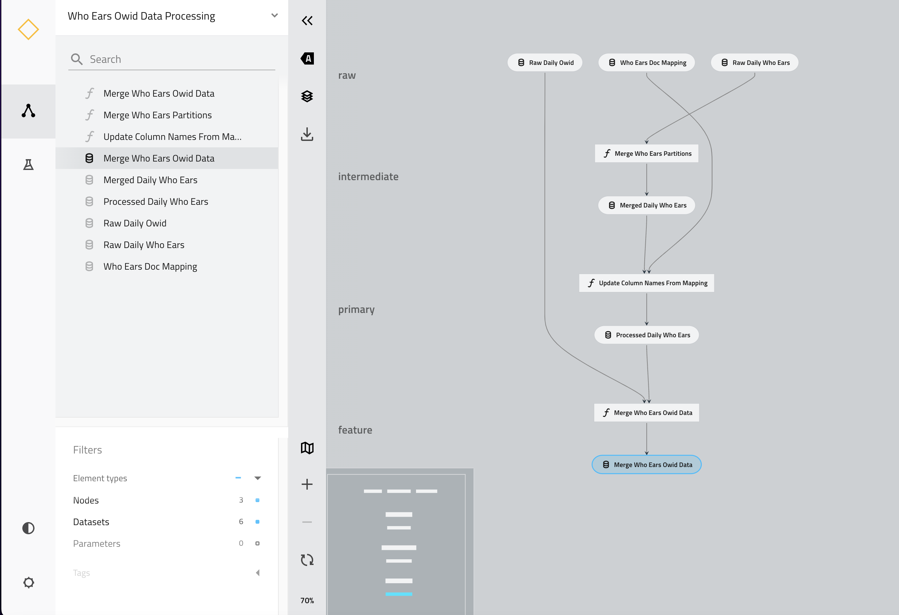

# who-ears-social-listening

### IMPORTANT: This repository is currently a work in progress and should be considered as such. In the coming months we will continue to finalize the codebase, outcomes and update references. It is also important to note that this repository is for research purposes. 

## Purpose of this project

Oftentimes the most innovative ideas are born out of the intersection of multiple disciplines in both technology and public health. In this session we will discuss what this looks like in practice by leveraging an actual use case, “Exploring Social Media indicators to Predict COVID-19 Trends", by beginning with initial experimentation and ending with production and publication of the outcomes of the research.

We would like to democratize our research and data to share with the larger community. In this repository you will find our ingestion pipelines, notebook experiments and with time our machine learning pipelines and deployment to production. We hope this will serve as a guide for anyone who wants to test out a hypothesis and make available these findings to the world using best practices in research, data engineering and machine learning. 

## Interactive Notebook

[](https://colab.research.google.com/github/ShawnKyzer/who-ears-social-listening/blob/main/who-ears-social-listening-pipeline/notebooks/External_who_ears_social_listening_analysis.ipynb)

## Data Ingestion Pipeline Overview 



### Environment Setup Instructions
* Install Anaconda instructions here (https://docs.anaconda.com/anaconda/install/index.html)
* Navigate to repository root directory and create then activate your python virtual environment:
    ```bash
     conda env create -f who-ears-social-listening.yml
     conda activate who-ears-social-listening
    ```
* Setup one of two IDEs PyCharm (https://kedro.readthedocs.io/en/stable/development/set_up_pycharm.html) or Visual Studio Code (https://kedro.readthedocs.io/en/stable/development/set_up_vscode.html)
* Install Kedro (v0.18.4) & Verify Installation
    ```bash
     pip install kedro==0.18.4
     kedro info
    ```
* Move into pipeline directory and proceed from README.md Located there
  ```bash
    cd who-ears-social-listening-pipeline
  ```

### References

* {Research Paper Link to be Added post DRAFT}

* {Links to important references and documentation}

### Data References
* Our World in Data. Coronavirus (COVID-19) Vaccinations [Internet]. Statistics and Research. 2021 [cited 2021 Apr 20]. Available from: https://ourworldindata.org/covid-vaccinations
* World Health Organization. EARS Methodology, Data and Definitions of the WHO Early AI-supported Response with Social Listening Platform [Internet]. 2022 [cited 2022 Dec 20]. Available from: https://www.who-ears.com/methodology/#/ and data https://github.com/citibeats-labs/who-ears/tree/main/data
